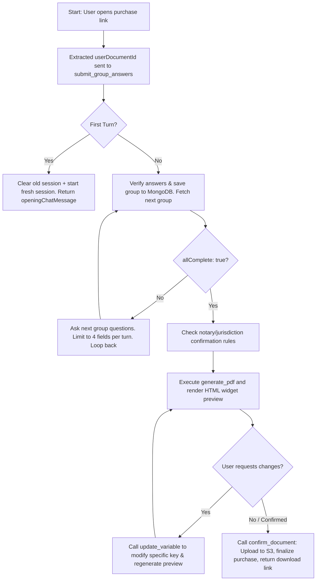

# NitroStack Document Assistant: Tools, Flow, and Guardrails Reference

This document provides a comprehensive overview of the architecture, tools, runtime execution flows, and guardrails of the **document-ai-prod** (`doc-assistant-mcp`) project, built using the [NitroStack](https://docs.nitrostack.ai/intro) MCP framework.

---

## 1. NitroStack Architectural Foundation
[NitroStack](https://docs.nitrostack.ai/intro) is a high-performance TypeScript framework designed for building Model Context Protocol (MCP) servers with visual UI extensions. Key features of the framework utilized in this project include:
- **Decorator-Based Design**: Metadata decorators like `@Tool`, `@Widget`, `@UseGuards`, and `@Injectable` describe APIs, widgets, authentication, and dependency injection directly on classes.
- **Type-Safe Validation**: Built-in integration with **Zod** schemas ensures request/response validation before execution.
- **Interactive UI Widgets**: Integration with frontend templates (React/Next.js) via the `@Widget` decorator to present rich graphical user interfaces (such as PDF previews) directly in MCP-compliant chat interfaces (e.g., NitroStudio).

---

## 2. Tools Reference

### Document Assistant Module
Managed by [DocAssistantTools](file:///Users/vc/Downloads/document-ai-prod/src/modules/doc-assistant/doc-assistant.tools.ts) and backed by [DocAssistantService](file:///Users/vc/Downloads/document-ai-prod/src/modules/doc-assistant/doc-assistant.service.ts), this module implements the primary document customizer flow.

| Tool Name | Decorators / Guards | Purpose | Input Schema Summary |
| :--- | :--- | :--- | :--- |
| `submit_group_answers` | `@UseGuards(JwtGuard)` | Saves user answers for the current template group, updates session status, and returns the next group of questions (or signals completion). | `userDocumentId` (ObjectId), `groupId` (string, optional), `answers` (Record of values), `userMessage` (verbatim text) |
| `generate_pdf` | `@UseGuards(JwtGuard)` `@Widget('pdf-preview')` | Validates session completeness and generates a visual PDF preview (HTML render) without completing the purchase. | `templateName` (string), `userDocumentId` (ObjectId, optional) |
| `update_variable` | `@UseGuards(JwtGuard)` `@Widget('pdf-preview')` | Multi-step tool to lookup or update a single variable's value and regenerate the PDF preview instantly. | `templateName` (string), `userDocumentId` (ObjectId, optional), `variableLabel` (string), `newValue` (string/number, optional) |
| `confirm_document` | `@UseGuards(JwtGuard)` | Uploads the final generated PDF to S3, updates the purchase record status to `DELIVERED`, and returns a secure download link. | `templateName` (string), `userDocumentId` (ObjectId, optional) |
| `analyze_template` | `@UseGuards(JwtGuard)` | Admin tool to extract variable mappings and conditional paths from a `.hbs` template file. | `templateName` (string) |
| `save_template_schema` | `@UseGuards(JwtGuard)` | Admin tool to persist a structured metadata schema mapping groups to variable constraints. | `templateName` (string), `schema` (JSON schema object) |
| `generate_sample_pdf` | `@UseGuards(JwtGuard)` `@Widget('pdf-preview')` | Diagnostics tool to verify Puppeteer and PDF export pipelines by generating a mock PDF document. | *None* |

---

## 3. Conversational & Processing Flow

The legal document assistant operates on a strict, linear state-machine process flow driven by user inputs and backend validations:

### Flow Checklist Details:
1. **Bootstrap Phase**: The assistant detects a 24-character hexadecimal `userDocumentId` from the checkout redirect. It initializes the session in the database via `submit_group_answers`.
2. **Sequential Questioning**: The assistant asks questions one group at a time. It uses conversational Dominican Spanish (tú form), limits questions to a maximum of 4 variables per message, and never formats questions as lists/bullets.
3. **Data Mapping & Normalization**: The model parses the user's plain text response, maps it to the schema keys, and submits it. Relative dates (e.g., "today", "hoy") are automatically translated by the server into formal legal dates.
4. **Calculations & Validation checks**: When all groups are collected, the backend runs validation logic (such as checking if the sum of wages, vacations, and bonuses equals the total legal payout).
5. **Draft Rendering**: Once complete, `generate_pdf` compiles the template (`src/templates/hbs`), converts it to HTML using custom parameters, uploads an ephemeral copy to S3, and renders it in the UI widget via a pre-signed URL.
6. **Modification Loop**: If the user detects a typo, they request a correction. The assistant invokes `update_variable` to modify the specific field and automatically refreshes the PDF preview.
7. **Final Delivery**: When approved, `confirm_document` uploads the permanent document to S3, sets the database record to `DELIVERED`, lock-marks the session to block further edits, and prints the markdown download link.

---

## 4. Guardrails & Safety Mechanisms

This codebase enforces strict guardrails to prevent data pollution, formatting errors, authentication bypasses, or brand identity dilution:

### A. Authentication & Security
- **JWT Protection**: The [JwtGuard](file:///Users/vc/Downloads/document-ai-prod/src/modules/doc-assistant/guards/jwt.guard.ts) interceptor enforces that all core document tools require a valid `Bearer` JSON Web Token. It decodes claims, verifies signatures via `JWT_SECRET`, and populates `context.auth` with user credentials.
- **Purchase Ownership Binding**: The [MongoService](file:///Users/vc/Downloads/document-ai-prod/src/modules/doc-assistant/mongo.service.ts) restricts access by verifying that the `userDocumentId` belongs to the authenticated user ID (`user_id`). Users cannot view or modify templates belonging to other accounts.

### B. Input Validation & Verification
- **Required Fields Verification**: `generate_pdf` runs verification on the session's answers against the schema. If any mandatory fields are missing, it blocks PDF creation and returns `success: false` with the missing field list.
- **Financial Breakdown Coherence**: For labor terminations (`Recibo de Descargo Laboral`), the system validates that the sub-items (severance, vacation, Christmas bonus) add up exactly to the overall total payout.
- **Date Formatting Rules**: The system prohibits asking users for separate date variables (such as day in letters, month in letters, etc.). The server parses a single natural date (e.g., "June 12, 2026") and splits it into Spanish legal dual date formats (`Doce (12) de Junio de Dos Mil Veintiséis (2026)`).

### C. Conversational & Brand Identity Constraints
- ** Caribbean Spanish (tú form)**: All user interactions must use the informal Dominican Spanish variant. Using Spain-specific vocabulary (e.g., "móvil", "ordenador", "vosotros") or the formal "usted" is blocked by system instruction.
- **Strict Brand Locking**:
  - The assistant must only refer to the legal firm as **AWL** and itself as **AWLi**.
  - All other platform terms (such as "AbogaciaWorks" or "Abogado.com.do") are strictly blacklisted.
  - The only permitted website domain is **https://awl.com.do/**.
- **Gender-Neutral/Non-Assumptive Language**: The assistant is forbidden from assuming the gender of the user or any parties. It must default to generic masculine terms ("el trabajador") until gender is explicitly declared or chosen.
- **Anti-apology Guard**: If a verification step fails, the assistant is instructed to not apologize as a technical glitch, but rather ask conversational follow-up questions to resolve the missing fields.
